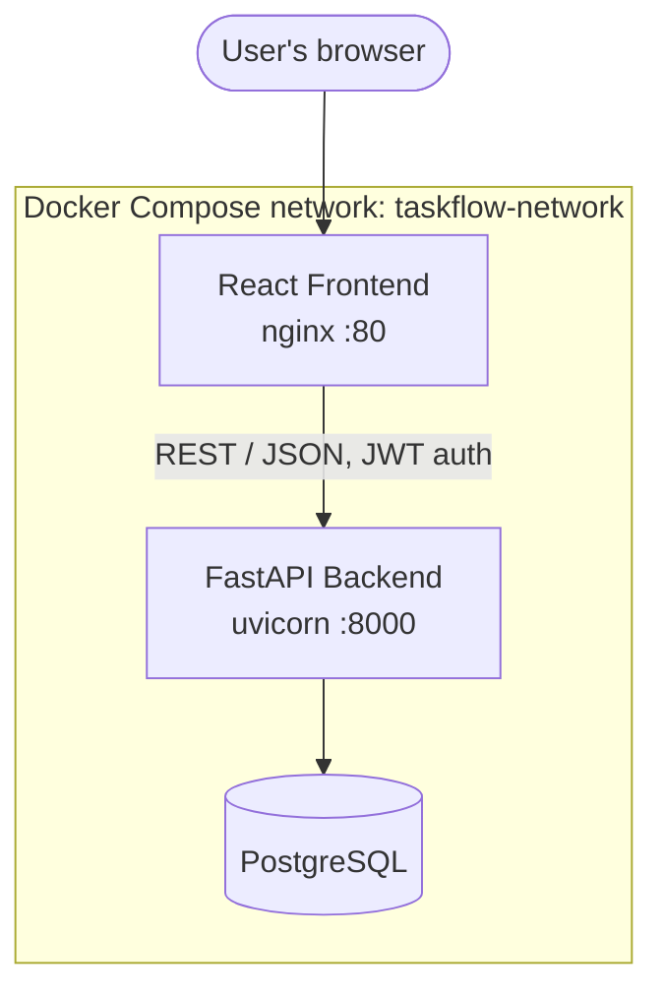
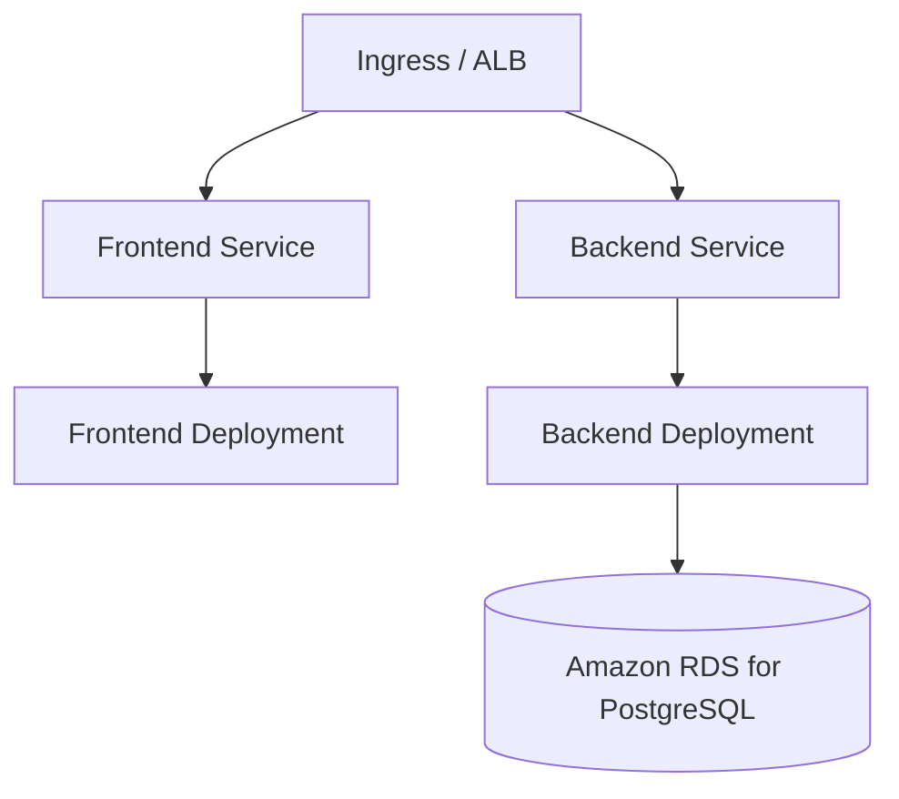

# TaskFlow

A full-stack team task management application: React frontend, FastAPI
backend, PostgreSQL database, all containerized with Docker and structured
for a future move to AWS EKS.

## Overview

TaskFlow lets a team create projects, break them into tasks, assign tasks
to teammates, track status through a workflow (To do → In progress → In
review → Completed), and see a dashboard summarizing where things stand.

## Architecture



**Request flow:** the browser loads the static SPA from nginx, which then
calls the FastAPI backend directly over HTTP using the `VITE_API_URL`
baked into the build. The backend authenticates requests with JWTs and
talks to PostgreSQL via SQLAlchemy.

## Features

- **Authentication** — registration, login, JWT-protected endpoints,
  bcrypt password hashing, profile endpoint
- **Projects** — create, view, update, delete; each has a name,
  description, owner, and creation date
- **Tasks** — create, view, update, delete; status (`TODO` /
  `IN_PROGRESS` / `REVIEW` / `COMPLETED`), priority (`LOW` / `MEDIUM` /
  `HIGH`), assignee, and project association
- **Dashboard** — total projects, total/completed/pending/in-progress
  tasks, recent tasks
- **Kanban board** — drag tasks between status columns

## Technology stack

| Layer | Technology |
|---|---|
| Frontend | React 18, Vite, React Router, Axios |
| Backend | Python, FastAPI, SQLAlchemy, Pydantic, python-jose, passlib/bcrypt |
| Database | PostgreSQL 16 |
| Containers | Docker, Docker Compose |
| Future deployment | Kubernetes, AWS EKS, ALB Ingress, ConfigMaps, Secrets |

## Repository structure

```
TaskFlow/
├── frontend/                # React + Vite SPA
│   ├── src/
│   │   ├── components/      # Reusable UI (AppShell, Modal, TaskCard, forms...)
│   │   ├── pages/            # Login, Register, Dashboard, Projects, Tasks, Profile...
│   │   ├── services/          # Axios API clients
│   │   ├── hooks/              # useAuth
│   │   ├── context/             # AuthContext
│   │   ├── tests/                 # Vitest + Testing Library
│   │   ├── App.jsx
│   │   └── main.jsx
│   ├── Dockerfile
│   ├── nginx.conf
│   ├── .dockerignore
│   ├── package.json
│   └── vite.config.js
│
├── backend/                 # FastAPI service
│   ├── app/
│   │   ├── api/              # auth, users, projects, tasks, dashboard routers
│   │   ├── models/            # SQLAlchemy models
│   │   ├── schemas/            # Pydantic schemas
│   │   ├── services/            # auth_service (JWT/user lookups)
│   │   ├── core/                  # config.py, security.py
│   │   ├── database.py
│   │   └── main.py
│   ├── tests/                # pytest suite
│   ├── Dockerfile
│   ├── .dockerignore
│   ├── requirements.txt
│   ├── requirements-dev.txt
│   └── .env.example
│
├── docs/
│   ├── kubernetes-deployment.md
│   └── k8s-future/           # Reference K8s manifests (not deployed)
│
├── docker-compose.yml
├── .env.example
├── sonar-project.properties
├── .gitignore
└── README.md
```

## Local setup

### Prerequisites
- Docker and Docker Compose
- (Optional, for running services outside Docker) Node.js 20+, Python 3.12+

### Quick start (Docker Compose)

```bash
git clone <this-repo>
cd TaskFlow
cp .env.example .env
# edit .env and set real values for JWT_SECRET_KEY and POSTGRES_PASSWORD

docker compose up --build
```

Once healthy:
- Frontend: http://localhost
- Backend API: http://localhost:8000
- API docs (Swagger UI): http://localhost:8000/docs

### Running without Docker (development)

**Backend**

```bash
cd backend
python -m venv .venv && source .venv/bin/activate
pip install -r requirements-dev.txt
cp .env.example .env   # point DATABASE_URL at a local Postgres instance
uvicorn app.main:app --reload
```

**Frontend**

```bash
cd frontend
npm install
cp .env.example .env
npm run dev
```

## Environment variables

### Root `.env` (used by `docker-compose.yml`)

| Variable | Description | Example |
|---|---|---|
| `POSTGRES_DB` | Database name | `taskflow` |
| `POSTGRES_USER` | Database user | `taskflow_user` |
| `POSTGRES_PASSWORD` | Database password | *(set your own)* |
| `JWT_SECRET_KEY` | Secret used to sign JWTs | *(set your own, long & random)* |
| `JWT_ALGORITHM` | JWT signing algorithm | `HS256` |
| `ACCESS_TOKEN_EXPIRE_MINUTES` | Token lifetime | `60` |
| `CORS_ORIGINS` | Comma-separated allowed origins | `http://localhost:5173,http://localhost:80` |
| `VITE_API_URL` | Backend URL baked into the frontend build | `http://localhost:8000` |

See `backend/.env.example` and `frontend/.env.example` for the per-service
equivalents when running outside Docker.

**Never commit a real `.env` file** — `.env` is already in `.gitignore`,
and only `.env.example` files should be tracked.

## Docker instructions

Build images individually:

```bash
docker build -t taskflow-backend:latest ./backend
docker build -t taskflow-frontend:latest ./frontend --build-arg VITE_API_URL=http://localhost:8000
```

## Docker Compose instructions

```bash
docker compose up --build        # start everything, rebuilding images
docker compose up -d              # start in the background
docker compose logs -f backend    # tail logs for one service
docker compose down                # stop and remove containers
docker compose down -v              # also remove the Postgres volume (destroys data)
```

Postgres data persists across restarts via the `taskflow_postgres_data`
named volume. The backend waits for Postgres to report healthy
(`pg_isready`) before starting, and the frontend waits for the backend to
report healthy before starting.

## API endpoints

All endpoints except `/health`, `/docs`, `/redoc`, registration, and login
require a `Authorization: Bearer <token>` header.

| Method | Path | Description |
|---|---|---|
| GET | `/health` | Liveness/readiness check |
| POST | `/api/v1/auth/register` | Create a user account |
| POST | `/api/v1/auth/login` | OAuth2-form login (also used by Swagger UI) |
| POST | `/api/v1/auth/login/json` | JSON-body login (used by the frontend) |
| GET | `/api/v1/auth/me` | Current user |
| GET | `/api/v1/users/me` | Current user profile |
| PUT | `/api/v1/users/me` | Update profile |
| GET | `/api/v1/users` | List active users (for task assignment) |
| POST | `/api/v1/projects` | Create a project |
| GET | `/api/v1/projects` | List your projects (with task-count stats) |
| GET | `/api/v1/projects/{id}` | Get one project |
| PUT | `/api/v1/projects/{id}` | Update a project |
| DELETE | `/api/v1/projects/{id}` | Delete a project (and its tasks) |
| GET | `/api/v1/projects/{id}/tasks` | List a project's tasks |
| POST | `/api/v1/tasks` | Create a task |
| GET | `/api/v1/tasks` | List tasks (optionally `?project_id=`) |
| GET | `/api/v1/tasks/{id}` | Get one task |
| PUT | `/api/v1/tasks/{id}` | Update a task |
| DELETE | `/api/v1/tasks/{id}` | Delete a task |
| GET | `/api/v1/dashboard` | Aggregated dashboard stats |

Full interactive documentation is available at `/docs` (Swagger UI) and
`/redoc` once the backend is running.

## Testing

**Backend**

```bash
cd backend
pip install -r requirements-dev.txt
pytest                                   # run the suite
pytest --cov=app --cov-report=xml        # with coverage (feeds SonarQube)
```

Covers authentication, project CRUD, task CRUD (including assignment),
dashboard aggregation, and the health endpoint — 19 tests in total.

**Frontend**

```bash
cd frontend
npm install
npm test                    # run once
npm run test:coverage        # with coverage (feeds SonarQube)
```

## Security scanning

### Trivy

```bash
# Filesystem scan — checks source, lockfiles, and IaC for known vulnerabilities and secrets
trivy fs .

# Image scans — after building the images above
trivy image taskflow-backend:latest
trivy image taskflow-frontend:latest
```

Both Dockerfiles use slim/alpine base images, multi-stage builds (so build
tools never ship in the runtime image), pinned dependency versions, and
run as non-root where practical:
- The backend container runs entirely as an unprivileged `taskflow` user.
- The frontend's nginx **worker processes** (which handle all HTTP
  traffic) run as the unprivileged `nginx` user; only the master process
  briefly holds root to bind port 80 at startup, which is the standard,
  portable way to serve on a privileged port without requiring extra
  Linux capabilities from the container runtime or Kubernetes.

Frontend JavaScript dependencies were pinned to versions with **zero**
known vulnerabilities per `npm audit` at the time of writing.

### SonarQube

A `sonar-project.properties` file at the repo root configures scanning
for both the React frontend (`frontend/src`) and Python backend
(`backend/app`), excluding `node_modules`, `venv`, `dist`, `build`,
`coverage`, and other generated paths.

```bash
# Generate coverage reports first (see Testing section above), then:
sonar-scanner \
  -Dsonar.projectKey=taskflow \
  -Dsonar.sources=frontend/src,backend/app \
  -Dsonar.host.url=<your-sonarqube-url> \
  -Dsonar.login=<your-token>
```

Or, with Docker:

```bash
docker run --rm \
  -v "$(pwd):/usr/src" \
  -e SONAR_HOST_URL=<your-sonarqube-url> \
  -e SONAR_LOGIN=<your-token> \
  sonarsource/sonar-scanner-cli
```

## Future Kubernetes / AWS EKS deployment

The app is not deployed to Kubernetes yet, but is structured to make that
straightforward: all configuration comes from environment variables, both
services expose lightweight health endpoints suitable for probes, and both
images are small and non-root-friendly.

See [`docs/kubernetes-deployment.md`](docs/kubernetes-deployment.md) for
the full guide, and [`docs/k8s-future/`](docs/k8s-future) for example
Deployment, Service, ConfigMap, Secret, HPA, and Ingress manifests
(reference only — not applied by this repo).



## Known limitations

- Docker images in this delivery have not been build-verified in a live
  Docker environment (the authoring sandbox has no Docker daemon) — verify
  `docker compose up --build` locally before relying on it.
- The backend creates database tables automatically on startup rather than
  using migrations; introduce Alembic before running this against a
  shared production database (see the Kubernetes guide).
- There's no rate limiting on auth endpoints yet.
- File/image attachments on tasks are not implemented.
- The Kubernetes manifests under `docs/k8s-future/` are illustrative
  starting points, not a production-hardened configuration — see the
  "Known gaps" section of the deployment guide.
